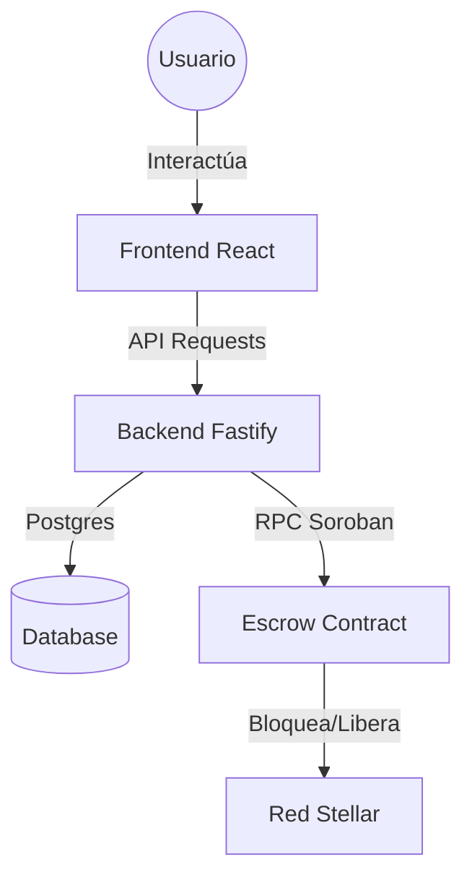
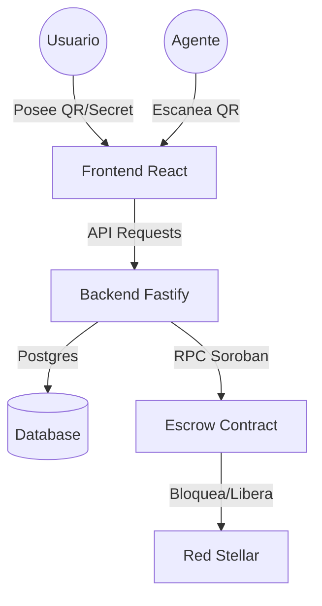

# 🍄 Micopay: Emerald Horizon

**Micopay** es un protocolo de intercambio P2P descentralizado que conecta el mundo del efectivo con el ecosistema de **Stellar & Soroban**. Nuestra misión es democratizar el acceso a las finanzas digitales permitiendo que cualquier persona retire o deposite fondos a través de una red confiable de agentes locales.


## 🌟 Visión del Proyecto
En mercados emergentes, la "última milla" de las criptomonedas es el efectivo. Micopay elimina la dependencia de bancos tradicionales mediante el uso de **Contratos Escrow (HTLC)** autogestionados, garantizando que el usuario siempre tenga el control de sus fondos.

## 🛠️ Stack Tecnológico
- **Blockchain**: Stellar Network & Soroban Smart Contracts (Rust).
- **Frontend**: React 19 + Vite + Tailwind CSS v4 (Diseño Premium "Emerald Horizon").
- **Backend**: Fastify (Node.js/TypeScript) como orquestador de trades.
- **Base de Datos**: PostgreSQL para persistencia de reputación y estados.

## 🏗️ Arquitectura del Sistema


## 🚀 Guía de Showcase (Local Demo)

Para mostrar el potencial de Micopay en este hackatón, configuramos un entorno que permite probar los flujos completos de **Retiro** y **Depósito** en menos de 2 minutos.

### 1. Requisitos
- Node.js v20+
- PostgreSQL (opcional, para persistencia total)

### 2. Iniciar el Backend
```bash
cd micopay/backend
npm install
npm run dev
```

### 3. Iniciar el Frontend
```bash
cd micopay/frontend
npm install
npm run dev
```
La aplicación estará disponible en `http://localhost:5188/`.

## 🔒 Seguridad: Smart Escrow (HTLC) & QR

La confianza en Micopay no depende de los intermediarios, sino de la criptografía. Utilizamos un sistema de **Hash Time-Locked Contracts (HTLC)** implementado en **Soroban (Stellar Smart Contracts)**.

### ¿Cómo funciona el Escrow?
1.  **`lock(secret_hash)`**: Cuando se inicia un trade, el Vendedor (quien tiene los USDC) bloquea los fondos en el contrato. Para esto, el backend genera un **Secreto Aleatorio** y solo guarda su **Hash**. Los fondos quedan "congelados" en el contrato.
2.  **`release(secret)`**: Para liberar los fondos, el Comprador debe presentar el **Secreto original** (no el hash). El contrato verifica que `sha256(secreto) == hash_guardado`. Si coincide, transfiere los fondos al Comprador instantáneamente.
3.  **`refund()`**: Si el intercambio físico no sucede tras un tiempo determinado (ej. 2 horas), el Vendedor puede recuperar sus fondos, evitando que queden atrapados.

### El Rol del Código QR
El QR que ves en la aplicación **ES el Secreto (Preimage)**. 
-   **Tú (Usuario)**: Tienes el QR en tu pantalla. Eres el único que posee la "llave" para liberar el dinero del contrato.
-   **El Agente**: Tiene el efectivo. Él no te entregará los billetes hasta que le permitas escanear el QR.
-   **El Intercambio**: Al escanear el QR, la app del Agente obtiene el secreto, firma una transacción en su billetera y **desbloquea** los USDC del contrato inteligente hacia su propia cuenta.


## 🏗️ Arquitectura del Sistema


---

### Documentación Técnica
-   **Contrato Soroban**: [lib.rs](file:///C:/Users/eric/Desktop/HACKATON/micopay/contracts/escrow/src/lib.rs)
-   **Integración Blockchain**: [Vea el Plan de Integración Stellar](file:///C:/Users/eric/Desktop/HACKATON/micopay_stellar_escrow_integration_plan.md)
-   **Walkthrough de Usuario**: [Ver Demo Visual](file:///C:/Users/eric/.gemini/antigravity/brain/eccb3bf5-8e77-4c92-8e00-dc1b58078d91/walkthrough.md)

---
*Desarrollado con ❤️ para el Stellar Hackatón 2024.*
