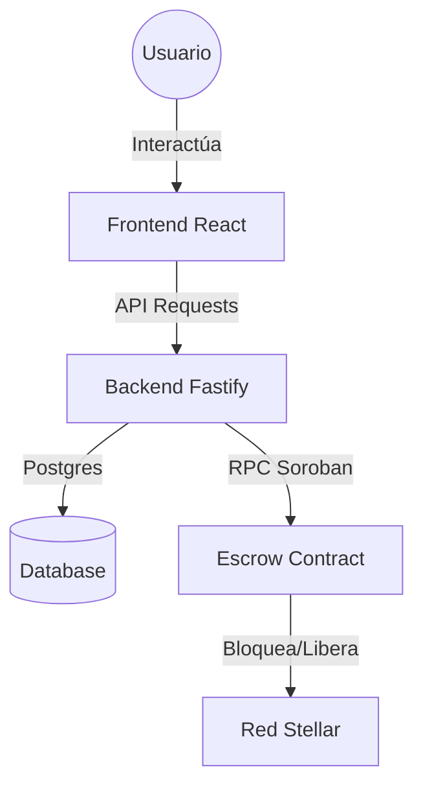

# 🍄 Micopay: Emerald Horizon

**Micopay** es un protocolo de intercambio P2P descentralizado que conecta el mundo del efectivo con el ecosistema de **Stellar & Soroban**. Nuestra misión es democratizar el acceso a las finanzas digitales permitiendo que cualquier persona retire o deposite fondos a través de una red confiable de agentes locales.


## 🌟 Visión del Proyecto
En mercados emergentes, la "última milla" de las criptomonedas es el efectivo. Micopay elimina la dependencia de bancos tradicionales mediante el uso de **Contratos Escrow (HTLC)** autogestionados, garantizando que el usuario siempre tenga el control de sus fondos.

## 🛠️ Stack Tecnológico
- **Blockchain**: Stellar Network & Soroban Smart Contracts (Rust).
- **Frontend**: React 19 + Vite + Tailwind CSS v4 (Diseño Premium "Emerald Horizon").
- **Backend**: Fastify (Node.js/TypeScript) como orquestador de trades.
- **Base de Datos**: PostgreSQL para persistencia de reputación y estados.

## 🏗️ Arquitectura del Sistema


## 🚀 Guía de Showcase (Local Demo)

Para mostrar el potencial de Micopay en este hackatón, configuramos un entorno que permite probar los flujos completos de **Retiro** y **Depósito** en menos de 2 minutos.

### 1. Requisitos
- Node.js v20+
- PostgreSQL (opcional, para persistencia total)

### 2. Iniciar el Backend
```bash
cd micopay/backend
npm install
npm run dev
```

### 3. Iniciar el Frontend
```bash
cd micopay/frontend
npm install
npm run dev
```
La aplicación estará disponible en `http://localhost:5188/`.

## 🔒 Seguridad e Integridad
- **Non-Custodial**: Las llaves privadas nunca salen del cliente.
- **HTLC (Secret Reveal)**: El intercambio de efectivo se asegura mediante un secreto que solo se revela cuando el comercio es exitoso.
- **Gestión de Reputación**: Un sistema basado en niveles (Espora, Micelio, Hongo, Maestro) que incentiva el buen comportamiento en la red.

---

### Documentación Adicional
- [Plan de Integración Stellar](file:///C:/Users/eric/Desktop/HACKATON/micopay_stellar_escrow_integration_plan.md)
- [Guía de Compilación de Contratos](file:///C:/Users/eric/Desktop/HACKATON/soroban_contract_compilation_plan.md)
- [Walkthrough Visual](file:///C:/Users/eric/.gemini/antigravity/brain/eccb3bf5-8e77-4c92-8e00-dc1b58078d91/walkthrough.md)

---
*Desarrollado con ❤️ para el Stellar Hackatón 2024.*
